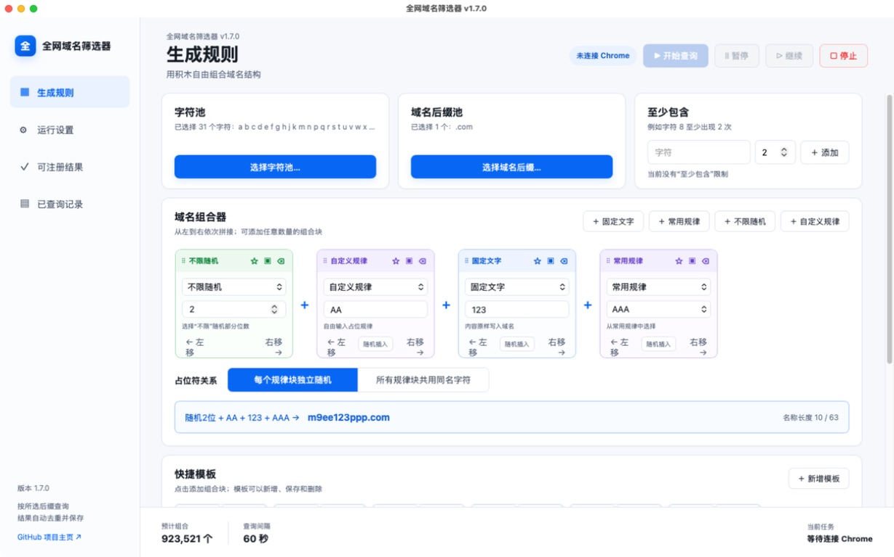
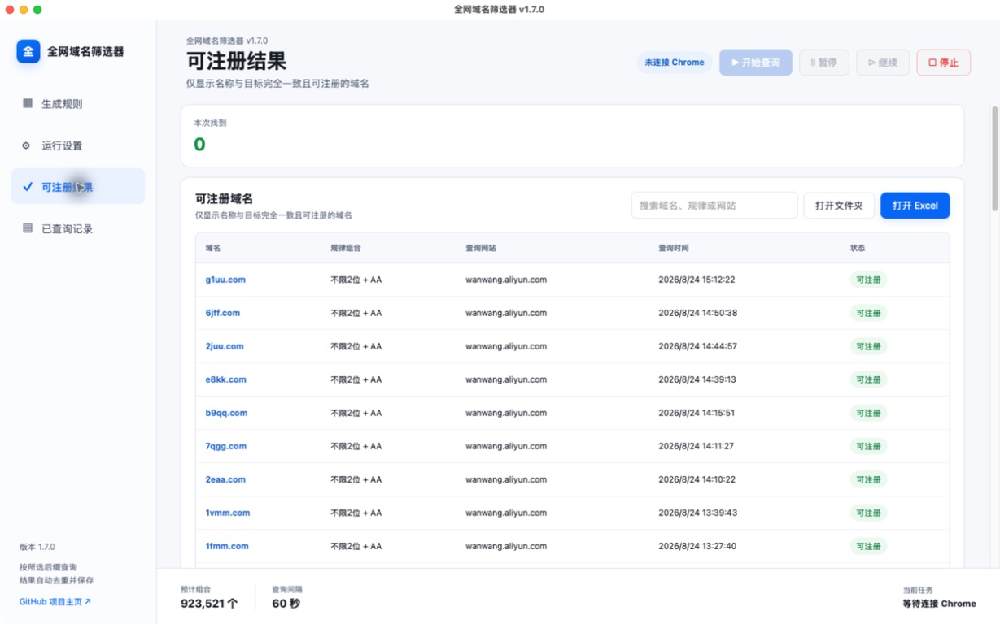

<div align="center">


# 全网域名筛选器 · Universal Domain Filter

### 在真实注册商页面自动组合、查询并整理所选后缀的可注册域名
### Generate, verify, and organize available domains across selected TLDs on real registrar pages

<p>
  
  
  
  
  
</p>

<p>
  <a href="https://github.com/PsyCompasss/com-domain-filter-macos/releases/latest"><strong>下载最新版 · Download</strong></a>
  &nbsp;·&nbsp;
  <a href="#快速开始--quick-start">快速开始 · Quick Start</a>
  &nbsp;·&nbsp;
  <a href="#常见问题--faq">常见问题 · FAQ</a>
  &nbsp;·&nbsp;
  <a href="https://github.com/PsyCompasss/com-domain-filter-macos/issues">问题反馈 · Issues</a>
</p>

</div>

---

## 软件简介 · Overview

全网域名筛选器是一款面向 macOS 的域名组合与查询工具。你可以选择后缀和字符、搭建规律或导入域名列表，并设置查询速度和停止条件。软件会通过 Cloudflare Registrar 或阿里云万网页面核对结果，只把“完整域名一致、页面明确显示可注册”的所选后缀写入 Excel。

Universal Domain Filter is a macOS utility for generating and checking domain-name combinations. Choose TLDs and characters, build reusable patterns or import a domain list, control the query pace, and set automatic stop conditions. The app checks candidates on Cloudflare Registrar or Alibaba Cloud Wanwang and saves only exact full domains that the registrar explicitly marks as available.

> 软件不会购买或注册域名，也不会破解验证码。最终注册前，请在注册商页面再次确认价格和状态。
>
> The app never purchases or registers domains and does not bypass CAPTCHAs. Always confirm availability and pricing on the registrar before buying a domain.

## 功能亮点 · Highlights

| | 中文 | English |
|:--:|---|---|
| 🧩 | **积木式域名组合**：固定文字、常用规律、自定义规律和不限随机可以任意添加、排序、复制和删除 | **Block-based builder:** Add, reorder, duplicate, or remove fixed text, presets, custom patterns, and unrestricted random blocks |
| 🌍 | **后缀池**：可从常用、其他公开、国家/地区、国际化和完整 IANA 分类中选择一个或多个后缀 | **TLD pool:** Select one or more suffixes from common, public, country/region, internationalized, or full IANA groups |
| 🔤 | **自定义字符池**：自由选择 26 个字母、10 个数字和半角连字符 `-` | **Custom character pool:** Select any combination of 26 letters, 10 digits, and the ASCII hyphen `-` |
| 📥 | **导入域名列表**：支持 TXT、CSV 和 Excel，可按导入顺序查询 | **Domain import:** Load TXT, CSV, or Excel lists and query them in their original order |
| 📌 | **至少包含**：限制生成结果至少出现指定字符及次数 | **Required characters:** Require a character to appear at least a specified number of times |
| 🎲 | **随机插入**：固定文字、常用规律和自定义规律可随机出现在名称的前、中或后部 | **Random insertion:** Place fixed text, presets, and custom patterns at random positions within the name |
| 🧬 | **灵活的占位符关系**：不同规律块可以独立随机，也可以让 `A、B、C` 在多个规律块之间共用字符 | **Flexible placeholder binding:** Generate each pattern independently or share `A`, `B`, and `C` across multiple blocks |
| 🎯 | **分组核对多个后缀**：每次提交一个名称，并对页面中所选后缀的完整域名逐一确认 | **Grouped multi-TLD verification:** Submit one name and confirm each selected full-domain result shown on the page |
| 🌐 | **多网站适配**：支持 Cloudflare Registrar 和阿里云万网 | **Multiple registrars:** Supports Cloudflare Registrar and Alibaba Cloud Wanwang |
| 🔄 | **自动恢复**：页面空白、结果延迟或临时加载失败时自动刷新当前查询 | **Automatic recovery:** Refreshes and retries the current query after blank pages, delayed results, or temporary failures |
| ⏯️ | **可暂停修改规则**：暂停期间修改组合，继续后从下一条域名采用新规则 | **Edit while paused:** Updated rules take effect from the next domain after resuming |
| 🧠 | **查询历史管理**：查看、搜索、筛选、导出或删除记录；删除后可以重新查询 | **History management:** View, search, filter, export, or delete records; deleted domains can be checked again |
| 📊 | **自动写入 Excel**：可注册结果集中保存并自动去重 | **Excel export:** Saves exact available results to one workbook with automatic deduplication |
| 🖥️ | **适合长时间后台运行**：软件不会自动移动、最小化或关闭 Chrome | **Background friendly:** Never moves, minimizes, or closes Chrome automatically |

## 界面预览 · Interface

### 生成规则 · Rule Builder

选择后缀池和字符池，用组合块搭建域名结构，或切换到导入模式，并实时预览结果与长度。

Choose TLDs and characters, assemble pattern blocks or switch to import mode, and preview the generated structure and length in real time.

<p align="center">
  
</p>

<table>
  <tr>
    <td width="50%" align="center"><strong>运行设置 · Run Settings</strong></td>
    <td width="50%" align="center"><strong>查询结果 · Available Results</strong></td>
  </tr>
  <tr>
    <td></td>
    <td></td>
  </tr>
  <tr>
    <td>连接查询网站，选择随机生成或导入来源，并设置查询速度、刷新间隔和停止条件。<br><br>Connect a registrar, choose generated or imported domains, and configure query speed, refresh delay, and stop conditions.</td>
    <td>查看已确认可注册的域名，并直接打开结果文件。<br><br>Review confirmed available domains and open the result workbook directly.</td>
  </tr>
</table>

## 工作流程 · How It Works

```text
选择后缀、生成规则或导入列表       连接软件专用 Chrome
Choose TLDs, rules, or a list  → Connect the dedicated Chrome window
                                      ↓
保存精确可注册结果         在注册商页面确认所选后缀
Save exact available     ← Verify selected TLDs on the registrar page
```

1. 软件根据字符池和组合块生成候选名称，或按导入列表顺序读取名称。
   The app generates candidate names from your selected characters and blocks, or reads names from an imported list in order.
2. 查询时只提交名称部分，例如搜索 `abc`，而不是 `abc.com`。
   Only the name is submitted—for example, `abc`, not `abc.com`.
3. 软件等待页面稳定，再查找所选后缀对应的完整域名并分别确认状态；页面缺少某个后缀时会明确记录为“未找到该后缀结果”。
   The app waits for a stable page, then confirms each selected full-domain result. A missing suffix is recorded as “result not found” rather than guessed as available or registered.
4. 只有明确显示可注册的结果才写入可注册结果 Excel；所有查询状态均可在历史页查看。
   Only explicitly available domains are saved to the availability workbook; every query status remains visible in history.

## 组合规则 · Pattern Builder

域名由多个组合块从左到右拼接，每个位置都可以自由选择类型。

A domain is assembled from left to right using any number of configurable blocks.

```text
固定文字      常用规律      不限随机      自定义规律      固定文字
Fixed text + Preset     + Random      + Custom      + Fixed text
    abc    +    ABC     +   4 chars   +   ABCBA     +     88
```

- **固定文字 · Fixed text**：保留输入内容，例如 `abc`、`88`。
- **常用规律 · Preset**：快速使用 `AAA`、`AABB`、`ABCABC` 等结构。
- **自定义规律 · Custom pattern**：输入任意占位结构，例如 `ABCDDDD`、`ABCBA`。
- **不限随机 · Unrestricted random**：从字符池随机生成指定长度的内容。
- **独立随机 · Independent binding**：每个规律块分别抽取自己的字符。
- **共用字符 · Shared binding**：所有规律块中的 `A` 共用一个字符，`B`、`C` 依次类推。

> 规律字母是占位符，不是固定输出内容。同一规律中的相同字母代表相同字符，不同字母代表不同字符。
>
> Pattern letters are placeholders, not literal output. Repeated letters reuse the same character; different letters represent different characters.

## 快速开始 · Quick Start

### 系统要求 · Requirements

- macOS
- Apple Silicon Mac
- 已安装 Google Chrome · Google Chrome installed

### 1. 下载 · Download

[前往 Releases 下载最新版 / Download the latest release](https://github.com/PsyCompasss/com-domain-filter-macos/releases/latest)

当前安装包仅提供 Apple Silicon 版本。
The current build is available for Apple Silicon only.

### 2. 打开软件 · Open the App

解压 ZIP 后打开 `全网域名筛选器.app`。如果 macOS 首次启动时拦截应用，请在 Finder 中右键点击软件并选择“打开”。

Extract the ZIP and open `全网域名筛选器.app`. If macOS blocks the first launch, right-click the app in Finder and choose **Open**.

> 当前安装包采用本地临时签名，尚未进行 Apple Developer ID 公证，因此首次打开时可能出现安全确认。
>
> The current package uses an ad-hoc local signature and is not notarized with an Apple Developer ID, so macOS may display a security confirmation on first launch.

### 3. 连接 Chrome · Connect Chrome

在“运行设置”中选择查询网站，点击“打开/连接 Chrome”。顶部显示“准备就绪”后即可开始。

Choose a registrar under **Run Settings**, click **Open / Connect Chrome**, and wait until the status changes to **Ready**.

## Chrome、隐私与后台运行 · Chrome, Privacy & Background Use

- 软件使用独立的 Chrome 窗口和资料目录，不会操作你平时打开的标签页。
  The app uses a dedicated Chrome window and profile without touching your regular tabs.
- 只有“打开/连接 Chrome”会创建软件专用窗口；“开始查询”只使用已连接的窗口。
  Only **Open / Connect Chrome** creates the dedicated window; **Start** uses the existing connection.
- 软件不会自动最小化、置前、移动或关闭 Chrome。
  The app never minimizes, focuses, moves, or closes Chrome automatically.
- 点击“停止”只结束当前任务，不会关闭 Chrome。
  **Stop** ends the current task without closing Chrome.
- 查询历史、设置和日志保存在本机，不会由本项目上传到服务器。
  Query history, settings, and logs remain on your Mac and are not uploaded by this project.

本地数据目录 · Local data directory:

```text
~/Library/Application Support/COM域名筛选器/
```

## 结果与状态 · Results & Statuses

- 可注册结果 Excel 只记录完整域名一致、且页面明确显示可注册的所选后缀。
  The availability workbook contains only exact full domains from the selected TLDs that are explicitly confirmed as available.
- “已查询记录”页面保留可注册、已注册、未确认和查询失败等状态。
  The history page retains available, registered, unconfirmed, and failed statuses.
- 删除历史记录后，对应域名可以重新查询；删除历史不会删除已有的可注册结果 Excel。
  Deleting a history record allows that domain to be checked again and does not remove existing availability results from Excel.
- 所有任务可以追加到同一个结果文件，并自动去重。
  Multiple runs can append to one deduplicated result workbook.

## 支持的网站 · Supported Registrars

| 网站 · Registrar | 地址 · URL | 状态 · Status |
|---|---|:--:|
| Cloudflare Registrar | `https://domains.cloudflare.com/` | ✅ 已适配 · Supported |
| 阿里云万网 · Alibaba Cloud Wanwang | `https://wanwang.aliyun.com/domain` | ✅ 已适配 · Supported |

可以在界面中保存其他网站，但查询前仍需为该网站编写页面适配器。

Other websites can be saved in the interface, but each one still requires a dedicated page adapter before it can be queried.

## 真人验证与查询频率 · CAPTCHA & Query Rate

- 查询太快更容易触发验证码或临时限制，请根据网站情况设置合理间隔。
  Faster queries are more likely to trigger CAPTCHAs or temporary rate limits; choose a responsible interval.
- 页面空白、结果延迟或临时网络故障时，软件会按设置自动刷新。
  Blank pages, delayed results, and temporary network failures are retried using the configured refresh delay.
- 同一域名连续失败三次后会跳过，避免任务永久卡住。
  A domain is skipped after three consecutive transient failures so the run does not stall indefinitely.
- 验证码必须由用户本人完成，软件不会破解或绕过网站安全机制。
  CAPTCHAs must be completed manually; the app does not defeat or bypass website security controls.

## 常见问题 · FAQ

<details>
<summary><strong>为什么某个已选后缀没有结果？ · Why is a selected TLD missing?</strong></summary>
<br>
部分注册商会把小众后缀放在瀑布流下方，或根本不返回该后缀。软件会在页面稳定后分段滚动查找；仍未出现时记录“未找到该后缀结果”，不会擅自判定为可注册或已注册。
<br><br>
Some registrars place less common TLDs lower in a lazy-loaded result list or omit them entirely. The app performs bounded scrolling after the page stabilizes; if a suffix still does not appear, it records “result not found” instead of guessing its status.
</details>

<details>
<summary><strong>为什么有些域名显示“查询失败”？ · Why is a domain marked as “Query failed”?</strong></summary>
<br>
通常表示网站在多次重试后仍未给出可确认的精确域名状态，或页面临时加载异常。可以在“已查询记录”中删除该条记录后重新查询。
<br><br>
This usually means the registrar did not provide a confirmable exact-domain status after multiple retries, or the page failed temporarily. Delete the record from Query History to check it again.
</details>

<details>
<summary><strong>软件会自动购买域名吗？ · Can the app purchase domains?</strong></summary>
<br>
不会。软件只查询并整理结果，不会登录账户、加入购物车、提交订单或付款。
<br><br>
No. The app only checks and organizes results. It does not sign in, add items to a cart, place orders, or make payments.
</details>

<details>
<summary><strong>为什么需要单独的 Chrome 窗口？ · Why is a dedicated Chrome window required?</strong></summary>
<br>
独立窗口让软件可以稳定保存连接信息和网站状态，同时避免影响用户平时使用的标签页。用户仍然可以手动最小化该窗口，查询会继续运行。
<br><br>
A dedicated window provides a stable browser connection and session while keeping regular browsing tabs untouched. You may minimize it manually while queries continue.
</details>

## 源码运行 · Run from Source

需要 Python 3.12 和 Google Chrome。
Python 3.12 and Google Chrome are required.

```bash
git clone https://github.com/PsyCompasss/com-domain-filter-macos.git
cd com-domain-filter-macos
python3.12 -m venv .venv
.venv/bin/python -m pip install -r requirements.txt
.venv/bin/python app.py
```

### 测试 · Tests

```bash
.venv/bin/python -m unittest discover -s tests -v
```

### 构建 macOS 软件 · Build the macOS App

安装依赖后双击 `重新构建Mac软件.command`。
After installing the dependencies, double-click `重新构建Mac软件.command`.

构建脚本会生成并临时签名 `.app`；GitHub Release 中另行提供 ZIP。正式分发前仍需根据发布渠道完成 Developer ID 签名、公证和渠道要求的审核。

The build script produces and ad-hoc signs the `.app`; GitHub Releases provide the ZIP package. Public distribution may still require Developer ID signing, notarization, and channel-specific review.

## 版本记录 · Changelog

- [v1.8.3 release notes](docs/releases/v1.8.3.md)
- [v1.5.2 release notes](docs/releases/v1.5.2.md)
- [All GitHub Releases](https://github.com/PsyCompasss/com-domain-filter-macos/releases)

## 反馈问题 · Feedback

如果你发现网站页面发生变化、结果判断异常或界面问题，请在 [GitHub Issues](https://github.com/PsyCompasss/com-domain-filter-macos/issues) 中提交可复现步骤、软件版本和已脱敏的截图。

If a registrar changes its page, a result is classified incorrectly, or the UI behaves unexpectedly, please open a [GitHub Issue](https://github.com/PsyCompasss/com-domain-filter-macos/issues) with reproducible steps, the app version, and a redacted screenshot.

---

<div align="center">

**按所选后缀查询 · 只保存完整域名一致且明确可注册的结果**
**Selected TLDs · Exact full-domain availability only**

</div>
